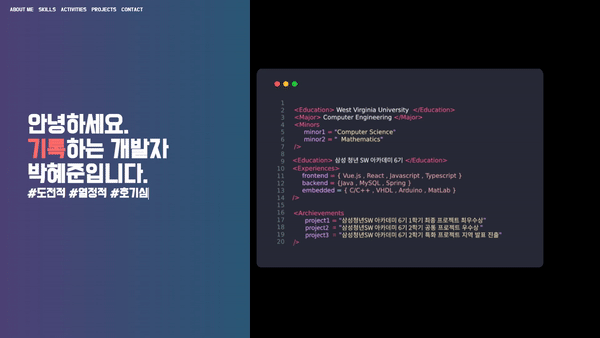

# June Park Frontend Portfolio

> ## Version 1.0
>
> ### 📅 기간 : 2022.04.08 - 2022.04.10
>
> ### @author : June Park

## 👀 Final Looks

## Tools Used

1. React
2. Javascript
3. Alice Carousel
4. Fullpage.js
5. WordCloud
6. TypeWriter

## Improvements to be made

1. 반응형으로 수정 : 현재 데스크탑에서 사이즈가 깨지는 배율 존재
2. 모바일 화면 준비 : 아직 마음에 드는 디자인은 없지만 추후에 모바일도 만들기
3. Full Page 수정 : 현재 full-page.js를 적용했더니 behavior가 약간 불편하고 이상해서 수정해야한다. 또, 스크롤 해도 인식을 잘 못하는 것 같다.
4. Navbar 현재 페이지 하이라이트하기
5. 우측에 페이지 dot indicator 추가하기 (여백 남겨둔 상태)
6. 드래그 비허용하기
7. Skills에서 글씨가 검정색으로 적용되어있는데 흰색으로 수정하기
8. Skills에서 Word Cloud에 scatter / shuffle / hover시마다 효과를 주고 싶다. 어떤 느낌으로 주어야하는지 아직은 더 생각해보아야 할 것 같다.
9. Activities 탭의 내용 공백이 이상하다. 디자인을 다시 해보면 좋을 듯 하다.또, 해당 탭에서 애니메이션 효과를 주면 좋을 듯 하다.
